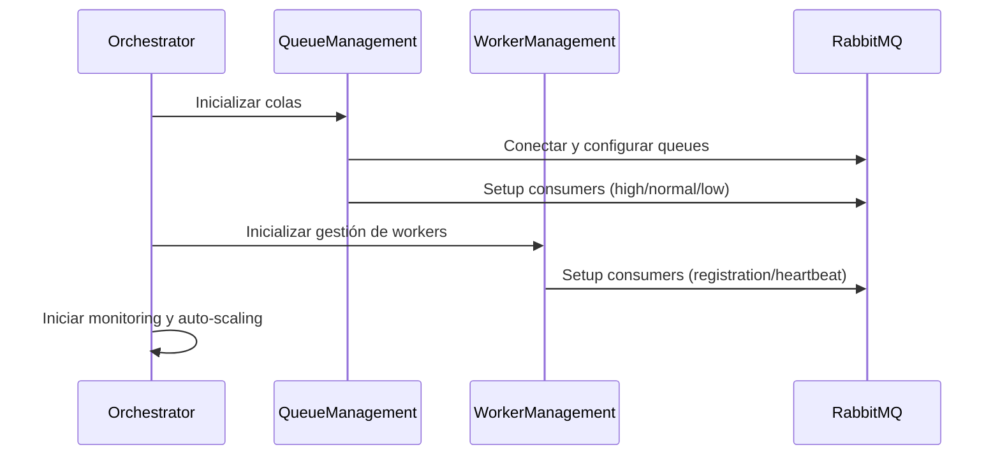
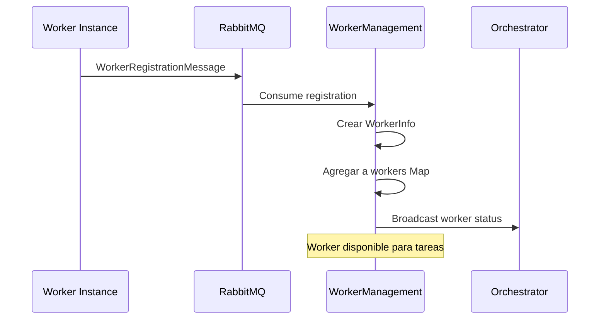
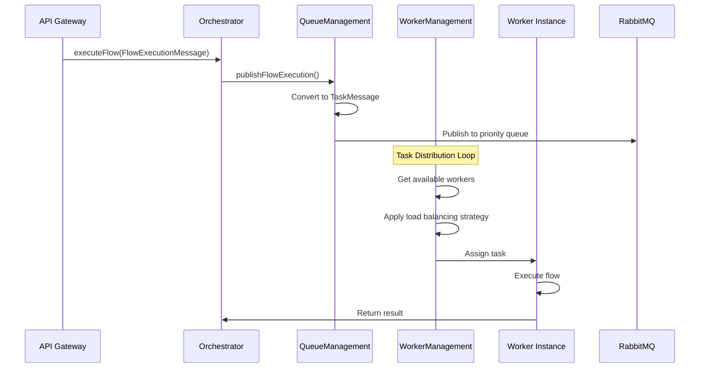

# Arquitectura del Orchestrator Service - Implementación Completa

## 🏗️ Resumen de la Implementación

Hemos completado exitosamente la **Fase 3.1 y 3.2** del plan de escalado, implementando un Orchestrator Service completamente funcional y autónomo que gestiona workers y asigna tareas de forma inteligente.

## 📁 Estructura del Proyecto

```
integrator.v2/orchestrator/
├── src/
│   ├── config/                     # ✅ Configuración centralizada
│   │   ├── orchestrator-config.service.ts
│   │   └── config.module.ts
│   ├── queue/                      # ✅ Gestión de colas de tareas
│   │   ├── queue-management.service.ts
│   │   └── queue.module.ts
│   ├── worker/                     # ✅ Gestión de workers
│   │   ├── worker-management.service.ts
│   │   └── worker.module.ts
│   ├── orchestrator/               # ✅ Lógica principal
│   │   ├── orchestrator.service.ts
│   │   ├── orchestrator.controller.ts
│   │   └── orchestrator.module.ts
│   ├── messaging/                  # ✅ Comunicación RabbitMQ
│   │   ├── messaging.service.ts
│   │   └── messaging.module.ts
│   ├── app.module.ts              # ✅ Módulo principal
│   └── main.ts                    # ✅ Bootstrap de la aplicación
├── .env                           # ✅ Variables de entorno
├── package.json                   # ✅ Dependencias NestJS v10
└── README.md
```

## 🔄 Flujo de Funcionamiento Completo

### 1. **Inicialización del Orchestrator**



### 2. **Registro de Workers**



### 3. **Asignación de Tareas**



## 🧩 Componentes Principales

### 1. **OrchestratorConfigService**
- **Propósito**: Configuración centralizada con 40+ variables del plan de escalado
- **Características**:
  - Auto-scaling: MIN_WORKERS=2, MAX_WORKERS=20
  - Load balancing: round_robin, least_busy, weighted
  - Health checks: cada 30 segundos
  - Queue watermarks: high=1000, low=100

### 2. **QueueManagementService**
- **Propósito**: Gestión inteligente de colas de tareas con prioridades
- **Funcionalidades**:
  - ✅ 3 niveles de prioridad (high/normal/low)
  - ✅ Dead Letter Queue para tareas fallidas
  - ✅ Monitoring de profundidad de colas
  - ✅ Retry logic automático
  - ✅ Routing de mensajes por prioridad

### 3. **WorkerManagementService**
- **Propósito**: Gestión autónoma de pool de workers
- **Capacidades**:
  - ✅ Registro automático de workers
  - ✅ Health monitoring continuo
  - ✅ 3 algoritmos de load balancing
  - ✅ Auto-scaling basado en carga
  - ✅ Redistribución de tareas en caso de fallos

### 4. **Load Balancing Strategies**

#### Round Robin
```typescript
// Distribuye tareas secuencialmente
worker1 → worker2 → worker3 → worker1...
```

#### Least Busy
```typescript
// Selecciona el worker con menor carga actual
workers.reduce((min, worker) => 
  worker.performance.currentLoad < min.performance.currentLoad ? worker : min
)
```

#### Weighted (Capacity-based)
```typescript  
// Selecciona basado en capacidad disponible
const availableCapacity = maxConcurrentTasks - tasksInProgress
// Selecciona el worker con mayor capacidad disponible
```

## 🚀 Cómo Funciona el Auto-Scaling

### Triggers de Escalado

1. **Scale Up** (Crear más workers):
   - Queue depth > HIGH_WATER_MARK (1000)
   - Average load > 70% 
   - No hay workers disponibles para tareas

2. **Scale Down** (Reducir workers):
   - Average load < 30%
   - Workers count > MIN_WORKERS (2)

### Proceso de Auto-Scaling

```typescript
// Evaluación cada minuto
private async evaluateScalingNeeds() {
  const stats = await this.getWorkerStats();
  const loadThreshold = 0.7; // 70%

  if (stats.averageLoad > loadThreshold && stats.total < maxWorkers) {
    await this.triggerAutoScaling(); // Crear nuevo worker
  } else if (stats.averageLoad < 0.3 && stats.total > minWorkers) {
    // Scale down logic
  }
}
```

## 🔧 Configuración de Worker Types

### Worker Capacity Configuration
```typescript
interface WorkerCapabilities {
  maxConcurrentTasks: number;    // Basado en maxConcurrentFlows
  supportedNodeTypes: string[];  // Tipos de nodos que puede ejecutar
  memoryLimitMB: number;        // Límite de memoria
  cpuCores: number;             // Cores de CPU disponibles
}
```

### Worker Health Monitoring
```typescript
interface WorkerPerformance {
  currentLoad: number;          // 0.0 - 1.0 (0% - 100%)
  tasksCompleted: number;       // Total de tareas completadas
  tasksInProgress: number;      // Tareas en ejecución
  averageExecutionTime: number; // Tiempo promedio de ejecución
  errorRate: number;           // Tasa de error (0.0 - 1.0)
}
```

## 📊 APIs del Orchestrator

### 1. Ejecutar Flow
```http
POST /orchestrator/execute
Content-Type: application/json

{
  "flowId": "flow-123",  
  "executionId": "exec-456",
  "priority": "high",
  "flowData": {
    "name": "Data Processing Flow",
    "version": 1,
    "nodes": [...],
    "connections": [...]
  },
  "inputs": {
    "data": "input data"
  }
}
```

### 2. Health Check
```http
GET /orchestrator/health

Response:
{
  "status": "healthy",
  "timestamp": "2025-08-03T...",
  "queues": [...],
  "workers": {
    "total": 5,
    "available": 3,
    "busy": 2,
    "averageLoad": 0.45
  }
}
```

## 🔄 Ciclo de Vida del Worker

### 1. **Worker Startup**
```typescript
// Worker se inicia y se registra
const registration: WorkerRegistrationMessage = {
  workerId: "worker-001",
  hostname: "worker-node-1",
  capacity: {
    maxConcurrentFlows: 5,
    maxConcurrentNodes: 10,
    memoryLimitMB: 1024,
    cpuLimitCores: 2
  },
  supportedNodeTypes: ["data-filter", "mongodb-operations", "postgresql-query"]
}
```

### 2. **Health Reporting**
```typescript
// Worker envía heartbeat cada 15 segundos
const heartbeat: WorkerHeartbeatMessage = {
  workerId: "worker-001",
  status: "healthy", // healthy | degraded | critical
  currentLoad: {
    activeFlows: 2,
    activeNodes: 5,
    memoryUsagePercent: 65,
    cpuUsagePercent: 45,
    queuedTasks: 1
  }
}
```

### 3. **Task Assignment**
```typescript
// Orchestrator asigna tarea basado en:
// 1. Worker disponible
// 2. Soporte para el tipo de nodo
// 3. Capacidad actual < 80%
// 4. Estrategia de load balancing
```

## 🎯 Beneficios de la Implementación

### ✅ **Escalabilidad Horizontal**
- Workers se pueden agregar/quitar dinámicamente
- Auto-scaling basado en métricas reales
- Soporte para 2-20 workers por defecto

### ✅ **Alta Disponibilidad**
- Health monitoring continuo
- Redistribución automática de tareas
- Dead Letter Queue para recovery

### ✅ **Load Balancing Inteligente**
- 3 estrategias configurables
- Basado en capacidad real de workers
- Optimización automática de distribución

### ✅ **Observabilidad Completa**
- Métricas detalladas por worker
- Queue depth monitoring
- Performance tracking
- Health status tracking

## 🚀 Próximos Pasos

### Fase 3.3: Job Scheduling System
- [ ] Implementar distributed cron jobs
- [ ] Timezone handling
- [ ] Job persistence

### Fase 4: Worker Service Implementation
- [ ] Crear Worker Service independiente  
- [ ] Integrar node-core library
- [ ] Implementar flow execution engine
- [ ] Health reporting automático

¿Te gustaría que proceda con la **Fase 4** para crear el Worker Service que será gestionado por este Orchestrator?
